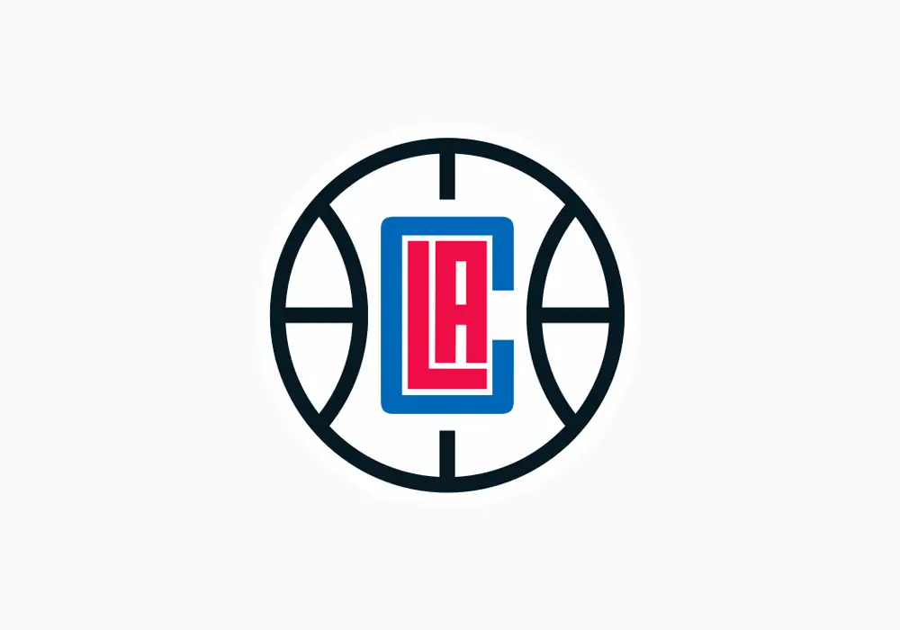
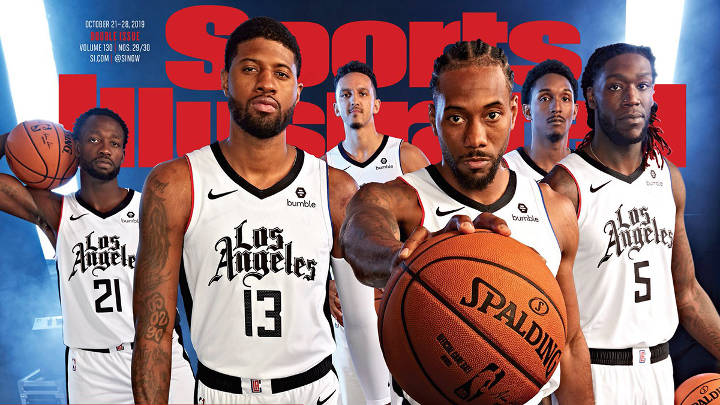
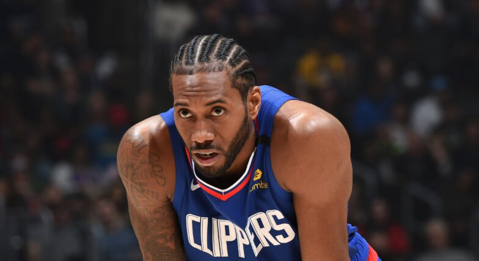

# eu-jikan.github.io
<!DOCTYPE HTML>
<html>
	<head>
		<meta charset="utf-8">
		<title> nba los angeles clippers </title>
	</head>
	<body>
		
		<h1> NBA Los Angeles CLIPPERS </h1>
		<h2> Les clippers de Los angeles sont une équipe de basketball basée à Los Angeles, elle joue en nba. </h2>
		<h3> Cette équipe a été créé en 1970 sous le nom de braves buffalo.
		<ul>
			<li>De 1970 à 1978 ils étaient à Tonroto (canada) et étaient connu sous le nom des braves de Buffalo</li>
			<li>De 1978 à 1984 ils étaient à San diego (californie) et étaient connu sous le nom des clippers de san diego </li>
			<li>De 1984 à maintenant ils sont à Los Angeles (californie) et sont appellé les Los angeles clippers</li>
		</ul>
		<h4>logo actuel: </h4>
		
		
		<h5> équipe 2021: </h5>
		
	</body>
</html>
